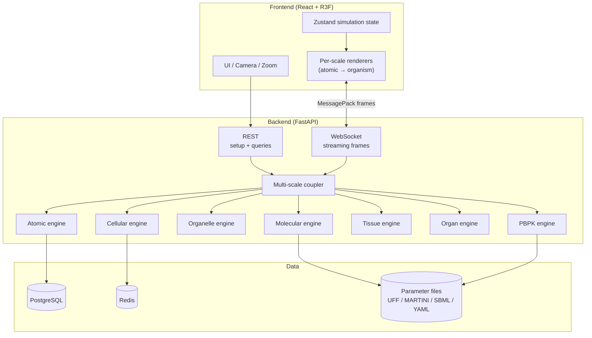
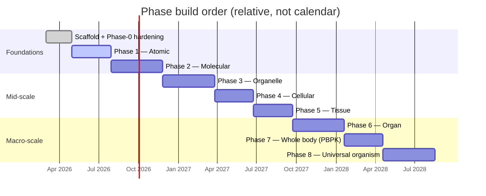
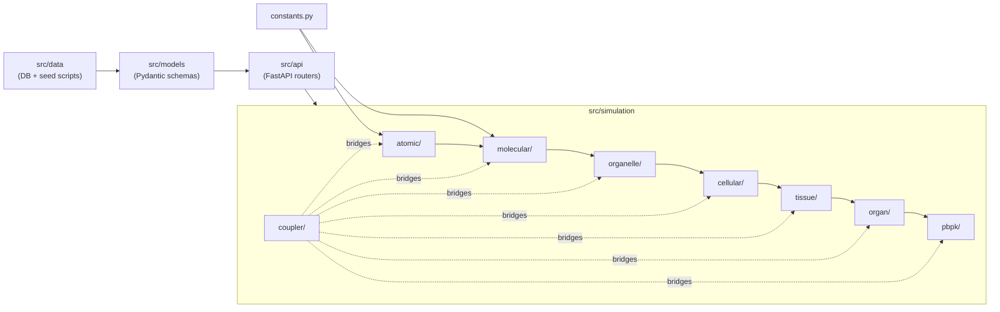

# Biochemistry — Master Build Plan

This document is the **build order** for every phase of Biochemistry. It answers: what gets built first, what depends on what, what must be validated before moving on, and how each phase hands off to the next.

CLAUDE.md defines *how to code*. README.md defines *what to build*. This document defines *in what order and why*.

---

## System architecture at a glance



## Phase build order (Gantt)



## Module dependency graph



---

## How to Read This Document

Each phase is broken into **stages**. Stages are sequential — do not start Stage N+1 until Stage N is validated. Within each stage, tasks are listed in dependency order. Tasks marked with `[GATE]` are validation checkpoints — the agent must confirm they pass before proceeding.

Each task specifies:
- **What**: The concrete deliverable
- **Where**: The file(s) to create or modify
- **Depends on**: Which prior tasks must be complete
- **Validates against**: How to know it's correct
- **Scalability check**: Why this approach will still work at later phases

---

## Infrastructure Setup (Before Any Phase)

This is not a phase — it's the one-time project scaffolding that must exist before any code is written.

### Stage 0.1: Project Skeleton

**Task 0.1.1: Initialize Python backend**
- What: Create `pyproject.toml` with `uv` as the package manager. Define the project metadata, Python 3.11+ requirement, and initial dependencies: `fastapi`, `uvicorn`, `numpy`, `scipy`, `numba`, `rdkit`, `pydantic>=2.0`, `sqlalchemy`, `asyncpg`, `redis`, `msgpack`, `pytest`, `ruff`, `mendeleev`
- Where: `backend/pyproject.toml`
- Install deps with `uv sync`
- Create `backend/src/__init__.py` and the top-level package structure:
  ```
  backend/src/
    __init__.py
    constants.py
    api/__init__.py
    simulation/__init__.py
    simulation/atomic/__init__.py
    simulation/molecular/__init__.py
    models/__init__.py
    data/__init__.py
  ```
- Every `__init__.py` is empty. Every `.py` file starts with `from __future__ import annotations`
- `constants.py` starts with the universal physical constants referenced in CLAUDE.md: speed of light, Boltzmann constant, Avogadro's number, Planck's constant, elementary charge, vacuum permittivity, Bohr radius, Hartree energy, gas constant. All with units documented in comments. All with explicit types (`float`)

**Task 0.1.2: Initialize TypeScript frontend**
- What: Create a React 18 + TypeScript project using Vite. Use `pnpm` as the package manager. Install: `three`, `@react-three/fiber`, `@react-three/drei`, `zustand`, `socket.io-client`, `msgpack-lite`
- Where: `frontend/` directory
- Configure `tsconfig.json` with `"strict": true`
- Configure ESLint
- Create initial directory structure:
  ```
  frontend/src/
    components/
      ui/
      three/
    hooks/
    stores/
    shaders/
    types/
    workers/
    App.tsx
    main.tsx
  ```

**Task 0.1.3: Docker infrastructure**
- What: Create `docker-compose.yml` with services for: PostgreSQL (port 5432), Redis (port 6379), backend (FastAPI on port 8000), frontend (Vite dev server on port 5175)
- Where: `docker-compose.yml`, `backend/Dockerfile`, `frontend/Dockerfile`
- The backend and frontend containers should hot-reload during development
- PostgreSQL should have a volume for data persistence
- Define environment variables: `DATABASE_URL`, `REDIS_URL`, `BACKEND_URL`

**Task 0.1.4: Database schema foundation**
- What: Create SQLAlchemy models and Alembic migrations for the element table. This table will be seeded in Phase 1 but the migration infrastructure must exist first
- Where: `backend/src/data/database.py` (connection setup), `backend/src/data/models/` (SQLAlchemy models), `backend/alembic/` (migration config)
- The database session should use async SQLAlchemy with `asyncpg`
- FastAPI dependency injection for database sessions per CLAUDE.md

**[GATE 0.1]**: The following must all be true before starting Phase 1:
- `uv sync` installs all Python deps without errors
- `pnpm install` installs all frontend deps without errors
- `docker-compose up` starts all services and they can communicate
- `pytest` runs (even with zero tests) and exits clean
- The frontend renders a blank React app at localhost:5175
- The backend responds to `GET /health` at localhost:8000
- PostgreSQL accepts connections and Alembic can run migrations
- `ruff check backend/src/` passes with no errors

---

## Phase 1: Atomic Simulator

### Stage 1.1: Element Data Pipeline

**Task 1.1.1: Element Pydantic models**
- What: Define the Pydantic v2 models that represent an element and its properties. This is the data contract — frontend TypeScript interfaces must mirror these exactly
- Where: `backend/src/models/atomic/element.py`
- Models needed:
  - `ElementBase`: atomic_number, symbol, name, group, period, block, category
  - `ElementProperties`: electronegativity (Pauling), atomic_mass, atomic_radius (empirical, calculated, van_der_waals, covalent), ionization_energies (list), electron_affinity, oxidation_states, melting_point, boiling_point, density, phase_at_stp, crystal_structure, electron_configuration, electron_configuration_abbreviated
  - `Isotope`: mass_number, atomic_mass, natural_abundance, half_life, decay_mode
  - `ElementFull`: combines ElementBase + ElementProperties + list of Isotopes
- All numeric fields must document units in `Field(description="...")`
- Canonical units for Phase 1: Ångströms for radii, eV for energies, Kelvin for temperatures, g/cm³ for density
- Depends on: Task 0.1.1
- Validates against: Can serialize/deserialize to JSON without data loss

**Task 1.1.2: Element database seeding**
- What: Write a migration script that pulls all 118 elements from the `mendeleev` Python package and inserts them into PostgreSQL using the schema from Task 1.1.1
- Where: `backend/src/data/seed_elements.py`
- The script must be idempotent (safe to run multiple times)
- Pull: atomic_number, symbol, name, group_id, period, block, atomic_weight, en_pauling, atomic_radius, atomic_radius_rahm, vdw_radius, covalent_radius_pyykko, ionization_energies, electron_affinity, oxidation_states, melting_point, boiling_point, density, phase at STP, electron configuration
- Pull all isotopes per element: mass_number, mass, abundance, half_life, decay mode
- Handle missing data gracefully — some elements (especially superheavy) have sparse data. Use `Optional` fields
- Depends on: Task 1.1.1, Task 0.1.4
- Validates against: Query the database — 118 elements present, hydrogen has atomic_number=1, carbon has 3 isotopes (12, 13, 14), uranium has the most isotopes

**Task 1.1.3: Element API endpoints**
- What: FastAPI router exposing element data via REST
- Where: `backend/src/api/elements.py`
- Endpoints:
  - `GET /api/v1/elements` — list all elements (paginated, filterable by block, group, period, phase_at_stp, electronegativity range)
  - `GET /api/v1/elements/{symbol}` — single element with full properties
  - `GET /api/v1/elements/{symbol}/isotopes` — isotopes for an element
- Response models are the Pydantic models from Task 1.1.1
- Depends on: Task 1.1.1, Task 1.1.2
- Validates against: `curl localhost:8000/api/v1/elements/H` returns hydrogen with correct atomic mass (1.008), `curl localhost:8000/api/v1/elements?block=d` returns all transition metals

**[GATE 1.1]**: Element data pipeline is complete when:
- All 118 elements are in the database with correct properties
- API returns accurate data for at least 10 spot-checked elements (H, C, N, O, Fe, Au, U, He, Na, Cl)
- Isotope data is correct for carbon (C-12, C-13, C-14 with correct abundances)
- Frontend can fetch and display element data (even as raw JSON in the console)

### Stage 1.2: Atomic Physics Engine

**Task 1.2.1: Quantum number calculator**
- What: Given an element, compute the full set of quantum numbers (n, l, ml, ms) for every electron
- Where: `backend/src/simulation/atomic/quantum.py`
- Input: atomic_number (int) and optionally a charge (int) for ions
- Output: list of (n, l, ml, ms) tuples, one per electron
- Must handle irregular configurations (Cr: [Ar] 3d⁵ 4s¹ not [Ar] 3d⁴ 4s²; Cu: [Ar] 3d¹⁰ 4s¹ not [Ar] 3d⁹ 4s²) — use empirical configurations from the database, do NOT compute from Aufbau principle alone
- Depends on: Task 1.1.2 (needs electron configuration data from DB)
- Validates against: Hydrogen has 1 electron at (1,0,0,+½). Carbon has 6 electrons. Iron has 26 electrons. Chromium has [Ar] 3d⁵ 4s¹ not [Ar] 3d⁴ 4s²

**Task 1.2.2: Orbital probability density calculator**
- What: Compute the probability density |ψ(r,θ,φ)|² for hydrogen-like orbitals on a 3D voxel grid
- Where: `backend/src/simulation/atomic/orbitals.py`
- Implementation:
  - Radial wave function R(n,l,r) using associated Laguerre polynomials (`scipy.special.assoc_laguerre`)
  - Angular wave function Y(l,ml,θ,φ) using spherical harmonics (`scipy.special.sph_harm`)
  - ψ(r,θ,φ) = R(n,l,r) × Y(l,ml,θ,φ)
  - Probability density = |ψ|²
  - Compute on a 64×64×64 Cartesian grid, converting (x,y,z) to (r,θ,φ) for evaluation
  - All grid computation must be fully vectorized NumPy — create the full (64,64,64) grid of (r,θ,φ) values first, then compute ψ on the entire grid at once. No nested Python loops
  - Use `np.float64` for all arrays. Document array shapes in docstring
- Output: `ndarray of shape (64, 64, 64)` containing probability density values, normalized so that the integral approximates 1
- Cache computed grids to disk as `.npy` files in `backend/cache/orbitals/`. Key by (n, l, ml)
- Precompute all orbitals up to n=4 (1s, 2s, 2p×3, 3s, 3p×3, 3d×5, 4s, 4p×3, 4d×5, 4f×7 = 30 orbitals total). Cache at startup or on first request
- Depends on: constants.py (Bohr radius)
- Validates against:
  - 1s orbital: spherically symmetric (density depends only on r, not θ or φ)
  - 2p_z orbital: dumbbell shape along z-axis with a node at the origin
  - 3d_z² orbital: two lobes along z-axis with a donut in the xy-plane
  - Integration of |ψ|² over all space ≈ 1.0 (within 5% on a 64³ grid)
- Scalability check: 64³ grid = 262,144 points per orbital. 30 orbitals × 262K × 8 bytes = ~63MB total cache. This is fine. Phase 2 won't need orbitals — it uses force fields

**Task 1.2.3: Spectral line calculator**
- What: Compute emission/absorption wavelengths for energy level transitions
- Where: `backend/src/simulation/atomic/spectra.py`
- For hydrogen-like atoms, use the Rydberg formula: 1/λ = R_∞ × Z² × (1/n₁² - 1/n₂²)
- For multi-electron atoms, use quantum defect corrections or empirical spectral data from NIST
- Output: list of (wavelength_nm, transition_from, transition_to, relative_intensity) tuples
- Convert wavelengths to RGB colors for frontend visualization (380-700nm visible range)
- Depends on: constants.py (Rydberg constant)
- Validates against: Hydrogen Balmer series: Hα = 656.3nm (red), Hβ = 486.1nm (cyan), Hγ = 434.0nm (violet)

**Task 1.2.4: Ionization calculator**
- What: Given an element and a number of electrons to remove, compute the resulting ion state
- Where: `backend/src/simulation/atomic/ionization.py`
- Input: element symbol, electrons_to_remove (int)
- Output: new electron configuration, total ionization energy required (sum of successive IEs), resulting charge, new set of quantum numbers
- Use empirical ionization energies from the database (do NOT compute from scratch)
- Depends on: Task 1.1.2 (ionization energy data), Task 1.2.1 (quantum numbers)
- Validates against: Removing 1 electron from Na requires 495.8 kJ/mol (1st IE). Removing 2 requires 495.8 + 4562 kJ/mol (huge jump — crossing into a noble gas core)

**Task 1.2.5: Orbital and spectra API endpoints**
- What: Expose the physics calculations via REST
- Where: `backend/src/api/atoms.py`
- Endpoints:
  - `POST /api/v1/atoms/orbitals` — body: `{n, l, ml, grid_size?}` → returns voxel grid as binary (MessagePack-encoded float32 array)
  - `POST /api/v1/atoms/quantum-numbers` — body: `{symbol, charge?}` → returns list of quantum number tuples
  - `POST /api/v1/atoms/spectrum` — body: `{symbol, n_max?}` → returns spectral lines
  - `POST /api/v1/atoms/ionize` — body: `{symbol, electrons_to_remove}` → returns ion state
- Binary response for orbital grids — do NOT send 262K floats as JSON. Use MessagePack or raw bytes with a content-type header
- Depends on: Tasks 1.2.1–1.2.4
- Validates against: Same validation as the underlying functions, plus: response times < 500ms for cached orbitals, < 5s for uncached

**Task 1.2.6: Atom state model**
- What: Define the mutable state of an atom instance for use in simulations
- Where: `backend/src/models/atomic/atom_state.py`
- Pydantic model:
  - element_symbol: str (immutable reference to element)
  - isotope_mass_number: int
  - charge: int (0 = neutral)
  - position: ndarray of shape (3,) dtype float64 — but stored as list[float] in Pydantic, converted at boundary
  - velocity: ndarray of shape (3,) dtype float64
  - excitation_state: int (which energy level the outermost electron occupies)
  - bonds: list[BondReference] (empty in Phase 1, used in Phase 2)
- This model persists across phases — an atom in a molecule in Phase 2 is the same object
- Depends on: Task 1.1.1
- Scalability check: This model must be lightweight. In Phase 2, a molecule of 10,000 atoms means 10,000 of these objects. Position and velocity should be stored in a flat NumPy array externally, with only an index in the state object pointing into the array

**[GATE 1.2]**: Atomic physics engine is complete when:
- Orbital grids for 1s, 2p, 3d, 4f are computed and visually distinguishable (different shapes)
- Hydrogen spectrum matches known Balmer series wavelengths to within 0.1nm
- Chromium electron configuration is [Ar] 3d⁵ 4s¹ (not the Aufbau-predicted [Ar] 3d⁴ 4s²)
- All calculations run in < 5 seconds for any element
- Test file `tests/simulation/atomic/test_orbitals.py` exists with `np.testing.assert_allclose` checks

### Stage 1.3: Frontend — Periodic Table & 3D Viewport

**Task 1.3.1: Three.js scene setup**
- What: Create a basic React Three Fiber scene with orbit controls, a light source, and a ground plane. Render a single colored sphere. Confirm the R3F integration works before adding complexity
- Where: `frontend/src/components/three/AtomViewport.tsx`
- Use `@react-three/drei` OrbitControls
- Use `useRef` for the mesh — never store Three.js objects in state
- Background: dark (#111111)
- Depends on: Task 0.1.2
- Validates against: A sphere renders, orbit controls rotate it, no console errors

**Task 1.3.2: Element Zustand store**
- What: Create a Zustand store that holds the currently selected element and its data
- Where: `frontend/src/stores/elementStore.ts`
- State shape: `{ selectedElement: ElementFull | null, loading: boolean, error: string | null, fetchElement: (symbol: string) => Promise<void> }`
- The `fetchElement` action calls the backend API and updates state
- TypeScript interface `ElementFull` must mirror the Pydantic model from Task 1.1.1
- Where: `frontend/src/types/Element.ts` for the TypeScript interface
- Depends on: Task 1.1.3 (API must exist to fetch from)
- Validates against: `useElementStore.getState().fetchElement('H')` populates the store with hydrogen data

**Task 1.3.3: Interactive periodic table component**
- What: Full 18-column periodic table as a React component (no Three.js needed)
- Where: `frontend/src/components/ui/PeriodicTable.tsx`
- Standard layout with lanthanides/actinides separated below
- Each cell shows: symbol, atomic number, atomic mass
- Background color by category (alkali metal = red-ish, noble gas = purple-ish, transition metal = blue-ish, etc.) — use CPK-inspired color mapping
- Clicking an element calls `fetchElement(symbol)` on the Zustand store
- Hover shows a tooltip with key properties (electronegativity, electron configuration, phase at STP)
- Filter controls: by block (s/p/d/f), by phase at STP, by electronegativity range
- Search bar: matches by name, symbol, or atomic number
- This is a standard React component — should work without the 3D viewport
- Depends on: Task 1.3.2
- Validates against: All 118 elements render in correct positions. Clicking carbon loads carbon data into the store. Filter by "noble gas" shows He, Ne, Ar, Kr, Xe, Rn, Og

**Task 1.3.4: Bohr model renderer**
- What: Render an atom in the Bohr model — concentric rings for electron shells, small spheres for electrons orbiting on them, a nucleus cluster of protons/neutrons
- Where: `frontend/src/components/three/BohrModel.tsx`
- Nucleus: cluster of spheres — red for protons, blue for neutrons. Count from element data and selected isotope
- Shells: `THREE.RingGeometry` at radii proportional to n² (1, 4, 9, 16...) scaled for visibility
- Electrons: small spheres on each ring, animated to orbit using `useFrame`. Number of electrons per shell from quantum number data
- Animate electron orbital motion — simple circular paths, speed inversely proportional to shell number
- Use `useMemo` for geometries, `useRef` for animated objects
- Depends on: Task 1.3.1, Task 1.3.2 (reads selected element from store)
- Validates against: Hydrogen shows 1 proton, 0 neutrons, 1 electron on the first shell. Carbon shows 6p/6n in nucleus, 2 electrons on shell 1, 4 on shell 2. Uranium shows multiple occupied shells

**Task 1.3.5: Electron cloud renderer**
- What: Render orbital probability density as volumetric fog or isosurfaces
- Where: `frontend/src/components/three/ElectronCloud.tsx`
- **Start with isosurface approach** (simpler): Run marching cubes on the backend to extract a mesh at a chosen density threshold, send as GLTF/mesh data, render as a semi-transparent mesh in Three.js. Color by phase (positive/negative wave function values — red/blue)
- **Upgrade path** (later): Full volume rendering with a custom ray-marching fragment shader using `THREE.DataTexture3D`. This is significantly harder — defer until the isosurface approach works
- Fetch orbital grid from `POST /api/v1/atoms/orbitals` endpoint
- For multi-electron atoms, show the occupied orbitals superimposed. Allow toggling individual orbitals on/off
- Depends on: Task 1.2.2, Task 1.2.5 (backend orbital computation and API)
- Validates against: 1s orbital looks like a sphere. 2p orbital looks like a dumbbell. 3d_z² looks like two lobes with a donut. Hydrogen shows only 1s. Carbon shows 1s + 2s + 2p orbitals
- Scalability check: Mesh data for 30 orbitals. Each isosurface mesh might be 10K-50K triangles. Total: ~1M triangles for all orbitals of a heavy element. This is fine for WebGL. In Phase 2, orbital rendering is not used (molecules use ball-and-stick), so this doesn't need to scale

**Task 1.3.6: Space-filling renderer**
- What: Render an atom as a single sphere scaled by van der Waals radius, colored by CPK convention
- Where: `frontend/src/components/three/SpaceFilling.tsx`
- Simple `THREE.SphereGeometry` with CPK color (C=gray, O=red, N=blue, S=yellow, H=white, Fe=orange, etc.)
- This is the visualization mode used when zoomed out in later phases — many atoms on screen
- Use `THREE.InstancedMesh` even for a single atom — this sets up the pattern for Phase 2 where thousands of atoms use instancing
- Depends on: Task 1.3.1, Task 1.3.2
- Validates against: Renders a correctly colored, correctly sized sphere. Hydrogen is small and white. Gold is large and gold-colored
- Scalability check: InstancedMesh with 1 instance is trivially fast. In Phase 2, this same component handles 10,000+ atoms by updating the instance count and instance attributes

**Task 1.3.7: Visualization mode switcher**
- What: UI controls to switch between Bohr model, electron cloud, and space-filling rendering modes
- Where: `frontend/src/components/ui/ViewControls.tsx`
- Store the current mode in the Zustand element store
- Switching modes should transition smoothly (fade out old, fade in new) — or at minimum be instant without flicker
- Depends on: Tasks 1.3.4, 1.3.5, 1.3.6

**Task 1.3.8: Atom inspector panel**
- What: Sidebar panel showing all properties of the currently selected atom
- Where: `frontend/src/components/ui/AtomInspector.tsx`
- Display:
  - Element name, symbol, atomic number
  - Electron configuration (full and abbreviated) with a visual shell diagram
  - All radii (atomic, covalent, van der Waals) as labeled values
  - Ionization energies as a bar chart (1st, 2nd, 3rd...)
  - Spectral emission lines as a visual spectrum bar (colored lines on a dark strip, 380-700nm)
  - Isotope selector (dropdown or table with abundance chart)
  - Visualization mode toggle (reuse ViewControls)
- Depends on: Task 1.3.2, Task 1.2.5 (spectral data from API)
- Validates against: Selecting hydrogen shows correct values. Spectral lines for hydrogen show red Hα, cyan Hβ, violet Hγ

**[GATE 1.3]**: Frontend is complete when:
- Periodic table renders all 118 elements with correct layout and colors
- Clicking an element loads it into the 3D viewport
- All 3 visualization modes work and switching between them is smooth
- Inspector panel shows accurate properties that match the backend API data
- Electron cloud shapes are visually distinguishable (s=sphere, p=dumbbell, d=clover, f=complex)
- No Three.js memory leaks — check with Chrome DevTools Memory tab during rapid element switching
- Rendering at 60fps for any single atom

### Stage 1.4: Integration & Validation

**Task 1.4.1: End-to-end demo scenario**
- What: A scripted test that exercises the full Phase 1 stack:
  1. Start backend and frontend
  2. Open the periodic table
  3. Click carbon
  4. Switch to electron cloud mode
  5. Verify 1s, 2s, and 2p orbitals are visible
  6. Switch to Bohr model
  7. Verify 2 electrons on shell 1, 4 on shell 2
  8. Check inspector panel shows correct ionization energies
  9. Check spectrum shows correct emission lines
- Where: Can be a manual test checklist initially, automated later
- Depends on: All of Stage 1.3

**Task 1.4.2: Performance benchmarks**
- What: Record baseline performance numbers
- Where: `docs/benchmarks/phase1.md`
- Measure:
  - Backend: Time to compute 1s orbital grid (target: < 1s)
  - Backend: Time to compute all 30 orbitals for n≤4 (target: < 30s)
  - Backend: API response time for element lookup (target: < 50ms)
  - Frontend: FPS during Bohr model animation (target: 60fps)
  - Frontend: FPS during electron cloud rendering (target: 30fps minimum)
  - Frontend: Memory usage after loading 10 different elements sequentially (should not grow unboundedly — dispose old geometries)

**Task 1.4.3: Reference validation**
- What: Compare simulation output against published experimental data
- Where: `tests/validation/test_phase1_validation.py`
- Validations:
  - Hydrogen orbital radial probability density peaks at a₀ (Bohr radius, 0.529Å) for 1s orbital
  - Hydrogen emission wavelengths match NIST Atomic Spectra Database values to within 0.1nm
  - Ionization energies for first 20 elements match NIST values to within 1%
- This is the Definition of Done criterion #7 from CLAUDE.md
- Depends on: Tasks 1.2.2, 1.2.3, 1.2.4

**[GATE 1.4 — PHASE 1 COMPLETE]**: Phase 1 is done when all 7 Definition of Done criteria from CLAUDE.md are met:
1. All backend deliverables have passing unit and integration tests
2. All frontend deliverables render correctly and are interactive
3. Backend API is documented (FastAPI auto-generates OpenAPI docs — verify at /docs)
4. Demo scenario runs end-to-end (Task 1.4.1)
5. Performance benchmarks recorded (Task 1.4.2)
6. Zoom transition: not applicable for Phase 1 (no previous phase to transition from)
7. Reference validation passes (Task 1.4.3)

---

## Phase 2: Molecular Simulator

### Pre-Phase 2 Checklist
- Phase 1 GATE 1.4 is complete
- The force field engine is the most important code in the entire project. If it's wrong, everything built on top of it is wrong. Budget significant time for validation
- Read CLAUDE.md Phase 2 notes before starting

### Stage 2.1: Molecular Structure Generation

**Task 2.1.1: Molecular data models**
- What: Pydantic v2 models for bonds, molecules, and molecular properties
- Where: `backend/src/models/molecular/molecule.py`, `backend/src/models/molecular/bond.py`
- Models:
  - `Bond`: atom1_index, atom2_index, order (float: 1.0, 1.5 aromatic, 2.0, 3.0), bond_type (enum: COVALENT, IONIC, HYDROGEN, VDW, COORDINATE), length_angstrom, energy_kjmol, force_constant
  - `MoleculeStructure`: atoms (list of atom states from Phase 1), bonds (list of Bond), positions (list of 3-tuples — but internally stored as ndarray of shape (N,3)), name, smiles, molecular_formula, molecular_mass
  - `MolecularProperties`: dipole_moment, sasa, volume, logp, pka, rotatable_bonds, hbd_count, hba_count, polar_surface_area
- Canonical units for Phase 2: Ångströms for distances, kJ/mol for energies, Daltons for masses, femtoseconds for time
- Depends on: Task 1.2.6 (atom state model)
- Scalability check: These models will be used in Phase 3 for coarse-grained beads with minor modification. Keep bond_type extensible

**Task 2.1.2: SMILES/PDB structure generator**
- What: Given a molecule specification, generate a complete 3D structure using RDKit
- Where: `backend/src/simulation/molecular/structure.py`
- Input: SMILES string, PDB file, or molecular formula
- Steps:
  1. Parse SMILES → molecular graph (`Chem.MolFromSmiles`)
  2. Add explicit hydrogens (`Chem.AddHs`)
  3. Generate 3D conformer (`AllChem.EmbedMolecule` with ETKDG method)
  4. Energy minimize with MMFF94 or UFF force field (`AllChem.MMFFOptimizeMolecule`)
  5. Extract atom positions, types, and bond connectivity
  6. Return as MoleculeStructure model
- For PDB files: use RDKit's PDB parser or BioPython
- For molecular formulas: use RDKit to determine the most likely structure
- Cache generated structures in the database by SMILES canonical form
- Depends on: Task 2.1.1
- Validates against:
  - Water (O) produces 3 atoms (O + 2H) with correct geometry
  - Ethanol (CCO) produces 9 atoms with correct 3D structure
  - Caffeine (Cn1c(=O)c2c(ncn2C)n(C)c1=O) produces the correct 24 atoms
  - Bond angles for water ≈ 104.5°, methane ≈ 109.5°

**Task 2.1.3: Molecular properties calculator**
- What: Compute molecular properties from structure using RDKit
- Where: `backend/src/simulation/molecular/properties.py`
- Use RDKit's built-in descriptors:
  - `Descriptors.MolWt` for molecular mass
  - `Descriptors.MolLogP` (Crippen) for LogP
  - `Descriptors.TPSA` for polar surface area
  - `Descriptors.NumHDonors`, `Descriptors.NumHAcceptors`
  - `Descriptors.NumRotatableBonds`
  - `AllChem.CalcVolume3D` for molecular volume
  - SASA via Shrake-Rupley if needed
- Do NOT reimplement any of these — RDKit is battle-tested
- Depends on: Task 2.1.2
- Validates against: Water LogP ≈ -1.38, ethanol LogP ≈ -0.31, benzene LogP ≈ 2.13 (within 0.5 of published values)

**Task 2.1.4: Molecule API endpoints**
- What: FastAPI router for molecular operations
- Where: `backend/src/api/molecules.py`
- Endpoints:
  - `POST /api/v1/molecules/from-smiles` — body: `{smiles: str}` → returns MoleculeStructure
  - `POST /api/v1/molecules/from-pdb` — file upload → returns MoleculeStructure
  - `GET /api/v1/molecules/{id}/structure` — retrieve cached structure
  - `GET /api/v1/molecules/{id}/properties` — retrieve computed properties
  - `GET /api/v1/molecules/library` — list pre-built common molecules
- Depends on: Tasks 2.1.2, 2.1.3

**[GATE 2.1]**: Structure generation works when:
- Water, ethanol, caffeine, and aspirin all generate correct 3D structures from SMILES
- Bond lengths are within 5% of experimental values
- LogP predictions are within 0.5 units of published values
- API returns structures in < 2 seconds for molecules up to 100 atoms

### Stage 2.2: Force Field Engine

This is the most critical code in the entire project. Every subsequent phase depends on it being correct.

**Task 2.2.1: Force field parameter loader**
- What: Load Universal Force Field (UFF) parameters from parameter files. UFF covers the entire periodic table
- Where: `backend/src/simulation/molecular/force_field_params.py`
- Parameters to load per atom type:
  - Bond stretching: equilibrium length (r_eq), force constant (k_b)
  - Angle bending: equilibrium angle (θ_eq), force constant (k_θ)
  - Torsional: barrier height (k_φ), periodicity (n), phase (δ)
  - Non-bonded: Lennard-Jones well depth (ε), equilibrium distance (σ)
  - Partial charges: from RDKit's Gasteiger charge calculation
- Parameters come from data files, NOT hard-coded in source. Store UFF parameter file in `backend/data/force_fields/uff.prm`
- Depends on: nothing (data loading only)
- Validates against: UFF parameters for carbon sp3 should give C-C bond length ≈ 1.54Å, C-H ≈ 1.09Å
- Scalability check: In Phase 3, we'll load MARTINI coarse-grained parameters from a different file using the same loader interface. Design the loader to be format-agnostic — it takes a parameter file path and returns a dictionary of atom_type → parameters

**Task 2.2.2: Bonded force calculations**
- What: Compute forces from bond stretching, angle bending, and torsional terms
- Where: `backend/src/simulation/molecular/forces.py`
- Functions:
  - `compute_bond_forces(positions, bond_pairs, r_eq, k_b) -> forces` — harmonic: E = k_b(r - r_eq)², F = -dE/dr
  - `compute_angle_forces(positions, angle_triples, θ_eq, k_θ) -> forces` — harmonic: E = k_θ(θ - θ_eq)²
  - `compute_dihedral_forces(positions, dihedral_quads, k_φ, n, δ) -> forces` — cosine: E = k_φ[1 + cos(nφ - δ)]
- All inputs/outputs are NumPy arrays. Positions: shape (N, 3), dtype float64. Forces: shape (N, 3), dtype float64
- All bond/angle/dihedral lists are NumPy int32 arrays of indices
- MUST be fully vectorized NumPy operations. No Python for-loops over bonds/angles
- Use Numba `@jit(nopython=True)` for any remaining loops that can't be vectorized
- Depends on: Task 2.2.1
- Validates against:
  - H₂ with r > r_eq: force pulls atoms together (negative along bond axis)
  - H₂ with r < r_eq: force pushes atoms apart (positive along bond axis)
  - Force magnitude = 0 at r = r_eq (equilibrium)
  - Water angle force = 0 at θ = 104.5°

**Task 2.2.3: Non-bonded force calculations**
- What: Compute Lennard-Jones and electrostatic forces between all non-bonded atom pairs
- Where: `backend/src/simulation/molecular/forces.py` (same file, separate functions)
- Functions:
  - `compute_lj_forces(positions, atom_types, epsilon, sigma, cutoff=12.0) -> forces`
    - E_lj = 4ε[(σ/r)¹² - (σ/r)⁶]
    - Apply cutoff at 10-12Å with a switching function (smooth force to zero between 10-12Å)
  - `compute_coulomb_forces(positions, charges, cutoff=12.0) -> forces`
    - E_coul = q_i × q_j / (4πε₀ × r)
  - Both functions must use a **neighbor list** for efficiency. Without a neighbor list, these are O(N²). With a neighbor list, approximately O(N)
- Neighbor list implementation:
  - Use `scipy.spatial.cKDTree` (NOT `KDTree` — CLAUDE.md is explicit about this)
  - Build cKDTree from positions, query all pairs within cutoff distance
  - Rebuild neighbor list every 10-20 steps (positions don't change much between steps)
  - Store neighbor list as a NumPy array of index pairs
- Exclude 1-2 pairs (bonded atoms) and 1-3 pairs (atoms sharing an angle) from non-bonded calculations. 1-4 pairs (atoms sharing a dihedral) are computed with scaled-down parameters
- Depends on: Task 2.2.1
- Validates against:
  - Two argon atoms at 3.4Å separation: LJ force ≈ 0 (equilibrium distance for Ar-Ar)
  - Two argon atoms at 3.0Å: repulsive force (positive)
  - Two opposite charges at 5Å: attractive force, magnitude matches Coulomb's law
- Scalability check: With cKDTree + neighbor list, a 10,000-atom molecule should compute non-bonded forces in < 100ms. Profile this. If it's too slow, apply Numba to the inner loop. In Phase 3, the same code handles coarse-grained beads (which are just "atoms" with different σ/ε parameters)

**Task 2.2.4: Integrator (Velocity Verlet)**
- What: Time-step the molecular dynamics simulation using the velocity Verlet algorithm
- Where: `backend/src/simulation/molecular/integrator.py`
- Algorithm:
  ```
  v(t + dt/2) = v(t) + (dt/2) × F(t) / m
  r(t + dt) = r(t) + dt × v(t + dt/2)
  Compute F(t + dt) from new positions
  v(t + dt) = v(t + dt/2) + (dt/2) × F(t + dt) / m
  ```
- Input: positions (N,3), velocities (N,3), masses (N,), forces (N,3), dt (float)
- Output: new positions, new velocities
- dt should be 1-2 fs (1e-15 s) for all-atom MD
- Masses from element data (in Daltons, convert to kg for force calculation or work in natural units)
- All arrays: dtype float64
- Depends on: Tasks 2.2.2, 2.2.3
- Validates against: Energy conservation — total energy (kinetic + potential) should fluctuate < 0.1% over 10,000 steps in the NVE (constant energy) ensemble for a simple molecule like methane or water. This is the single most important validation for the entire force field engine
- Scalability check: The integrator itself is trivial (array addition). The bottleneck is force computation. This same integrator works for coarse-grained MD in Phase 3 — just pass different masses and force field parameters

**Task 2.2.5: Thermostat (Berendsen)**
- What: Maintain constant temperature by rescaling velocities each step
- Where: `backend/src/simulation/molecular/thermostat.py`
- Berendsen thermostat: scale velocities by λ = sqrt(1 + (dt/τ) × (T_target/T_current - 1))
  - τ is the coupling time constant (typically 0.1-1.0 ps)
  - T_current computed from kinetic energy: T = 2/(3Nk_B) × Σ(½mv²)
- Also implement velocity initialization: assign random velocities from a Maxwell-Boltzmann distribution at the target temperature
- Depends on: Task 2.2.4
- Validates against: Starting from T=0, the thermostat should bring the system to the target temperature (300K) within ~1000 steps (1ps). Temperature should fluctuate around 300K ± ~10K after equilibration

**Task 2.2.6: MD simulation runner**
- What: The main simulation loop that ties together force computation, integration, and thermostat
- Where: `backend/src/simulation/molecular/md_engine.py`
- Class `MDEngine` with:
  - `__init__(molecule: MoleculeStructure, force_field: ForceFieldParams, temperature: float = 300.0, dt: float = 1.0)`
  - `step() -> SimulationFrame` — advance one timestep, return positions/velocities/energies
  - `run(n_steps: int, frame_interval: int = 100) -> list[SimulationFrame]` — run N steps, return frames every `frame_interval` steps
- `SimulationFrame`: positions (N,3), velocities (N,3), potential_energy, kinetic_energy, temperature, step_number, time_ps
- Engine interface per CLAUDE.md Architecture Principle #1:
  - Input: MoleculeStructure (initial conditions)
  - Output: SimulationFrame (positions, velocities, energies for visualization)
  - Timestep: 1-2 fs
  - Spatial resolution: individual atoms (~1Å)
- Depends on: Tasks 2.2.1–2.2.5
- Validates against: Run 10,000 steps of methane at 300K in NVE ensemble. Total energy drift < 0.1%. Run water at 300K with thermostat. O-H bond length oscillates around 0.96Å. H-O-H angle oscillates around 104.5°
- Scalability check: Must handle 10,000 atoms at > 1000 steps/second on CPU (NumPy + Numba). Profile and optimize. In Phase 3, this same engine runs coarse-grained MD by passing CG parameters instead of all-atom parameters — design the engine to be parameter-agnostic

**Task 2.2.7: MD WebSocket streaming**
- What: Stream simulation frames from backend to frontend in real-time via WebSocket
- Where: `backend/src/api/simulation.py`
- WebSocket endpoint: `ws://localhost:8000/ws/simulation`
- Use the WSMessage format from CLAUDE.md: `{type: "frame", timestamp: float, payload: bytes}`
- Payload is MessagePack-encoded: `{positions: Float32Array, energies: {pe, ke, total, temperature}}`
- Send frames every 100-1000 steps (configurable). At 1fs timestep and sending every 100 steps, that's one frame per 0.1ps — ~100fps if computation can keep up
- Position arrays sent as Float32Array (not float64 — halves bandwidth, sufficient precision for rendering)
- Do NOT send as JSON. A 10,000-atom molecule at 30fps = 10,000 × 3 × 4 × 30 = 3.6 MB/s as binary, vs ~36 MB/s as JSON
- Depends on: Task 2.2.6
- Validates against: Frontend receives frames, positions update smoothly, no visible jitter
- Scalability check: 3.6 MB/s is fine for localhost. Over network, may need delta compression (send only position changes). Address this in Phase 3 if needed

**[GATE 2.2]**: Force field engine is correct when:
- H₂ bond length equilibrates to 0.74 ± 0.02 Å
- O₂ bond length equilibrates to 1.21 ± 0.02 Å
- N₂ bond length equilibrates to 1.10 ± 0.02 Å
- Water bond angle equilibrates to 104.5 ± 2°
- Methane bond angle equilibrates to 109.5 ± 2°
- Energy conservation in NVE ensemble: total energy drift < 0.1% over 10,000 steps
- Temperature stabilizes at target (300K ± 10K) with thermostat enabled
- 1000-atom molecule runs at > 1000 steps/second on CPU
- All tests in `tests/simulation/molecular/test_force_field.py` pass

### Stage 2.3: Frontend — Molecular Visualization

**Task 2.3.1: Ball-and-stick renderer**
- What: Render molecules with atoms as spheres and bonds as cylinders
- Where: `frontend/src/components/three/BallAndStick.tsx`
- Atoms: `THREE.InstancedMesh` with `THREE.SphereGeometry`. Per-instance: position, radius (covalent radius), color (CPK convention). This reuses the space-filling component from Phase 1 with different radii
- Bonds: `THREE.CylinderGeometry` oriented between atom pairs. Single bonds = 1 cylinder, double bonds = 2 thinner parallel cylinders offset ±0.1Å, triple bonds = 3
- Must handle up to 10,000 atoms at 60fps using instancing
- Depends on: Task 1.3.6 (space-filling renderer is the base)
- Validates against: Water renders as red sphere (O) bonded to two white spheres (H) at ~104.5°. Benzene shows alternating single/double bonds (or aromatic dashed bonds)

**Task 2.3.2: WebSocket frame receiver**
- What: Frontend WebSocket client that receives MD simulation frames and updates the 3D scene
- Where: `frontend/src/hooks/useSimulation.ts`, `frontend/src/workers/frameDecoder.ts`
- Use Socket.IO client for the WebSocket connection
- Decode MessagePack payload in a Web Worker to avoid blocking the main thread
- Implement a frame buffer: accumulate 3-5 incoming frames and interpolate between them for smooth rendering even if frames arrive at irregular intervals
- Update the InstancedMesh instance matrices with new positions each frame
- Store simulation state (positions, energies, temperature) in a Zustand store
- Depends on: Task 2.2.7 (backend WebSocket endpoint)
- Validates against: Atoms visibly vibrate when MD simulation is running. Motion is smooth (no jitter from frame timing). Pausing the simulation freezes the display

**Task 2.3.3: Space-filling (CPK) renderer**
- What: Atoms as large spheres (van der Waals radius), overlapping where close. No bonds shown
- Where: Extend `frontend/src/components/three/SpaceFilling.tsx` from Phase 1
- Already uses InstancedMesh. Just update to handle N atoms instead of 1, with van der Waals radii
- Depends on: Task 1.3.6

**Task 2.3.4: Wireframe renderer**
- What: Bonds as lines, atoms as small points. Fastest rendering for large molecules
- Where: `frontend/src/components/three/Wireframe.tsx`
- Use `THREE.LineSegments` with `THREE.BufferGeometry` for bonds
- Use `THREE.Points` for atoms (small dots at atom positions)
- This is the fallback for molecules > 10,000 atoms where ball-and-stick is too expensive
- Depends on: Task 2.1.1 (needs bond connectivity data)

**Task 2.3.5: Ribbon diagram renderer (proteins)**
- What: For proteins, trace the backbone and render as a smooth ribbon
- Where: `frontend/src/components/three/RibbonDiagram.tsx`
- Extract Cα atom positions from the molecule
- Create a Catmull-Rom spline (`THREE.CatmullRomCurve3`) through Cα positions
- Extrude a cross-section along the spline using `THREE.TubeGeometry`
- Color by secondary structure: α-helices = wide ribbon or coil (red), β-sheets = flat arrows (yellow), loops = thin tube (gray)
- Secondary structure assignment: use DSSP algorithm or get from PDB file header
- Depends on: Task 2.1.2 (PDB parsing)
- Validates against: Loading a known protein (e.g., lysozyme, PDB: 1AKI) shows recognizable secondary structure elements

**Task 2.3.6: Molecular surface renderer**
- What: Render the molecular surface (Connolly/SAS) as a mesh
- Where: `frontend/src/components/three/MolecularSurface.tsx`
- Compute surface on the backend using marching cubes on a grid of distance-from-atom values
- Send mesh data (vertices, normals, faces) to frontend
- Color options: by element, by electrostatic potential (red=negative, blue=positive), by hydrophobicity
- Depends on: Task 2.1.2

**Task 2.3.7: Simulation controls UI**
- What: UI panel for controlling the MD simulation
- Where: `frontend/src/components/ui/SimulationControls.tsx`
- Controls:
  - Play / Pause / Step (advance one frame)
  - Temperature slider (50K - 1000K)
  - Visualization mode selector (ball-and-stick, CPK, wireframe, ribbon, surface)
  - Simulation speed (frames per second to backend)
  - Energy display: KE, PE, total, temperature — as real-time values and a small chart
- Depends on: Task 2.3.2

**Task 2.3.8: Molecule builder**
- What: Simple tool where users click to place atoms and drag to form bonds
- Where: `frontend/src/components/ui/MoleculeBuilder.tsx`
- Click on empty space → place a carbon atom (default element)
- Select element from a mini periodic table palette
- Drag between atoms to create bonds (click order to cycle single → double → triple)
- Auto-add hydrogens when requested
- Energy minimize when requested (sends to backend, gets back optimized positions)
- Depends on: Task 2.3.1 (rendering), Task 2.1.2 (backend structure optimization)

**Task 2.3.9: Molecule search and library**
- What: UI for finding and loading molecules
- Where: `frontend/src/components/ui/MoleculeLibrary.tsx`
- Pre-built library of common molecules: water, glucose, ATP, all 20 amino acids, ethanol, caffeine, aspirin, nicotine, benzene, CO, CO₂, O₂, N₂, H₂
- Each molecule has a card with 2D structure (RDKit-generated SVG), name, formula, key properties
- Search by name, SMILES, or molecular formula
- "Load in 3D" button that fetches from backend and renders
- Depends on: Task 2.1.4 (molecule API)

**[GATE 2.3]**: Frontend is complete when:
- All 5 visualization modes work for a small molecule (ethanol) and a protein (lysozyme)
- Ball-and-stick renders 10,000 atoms at 60fps
- MD simulation streams in real-time — molecules visibly vibrate
- Temperature slider changes vibration amplitude
- Molecule builder can create a simple molecule (e.g., methane) and submit for energy minimization

### Stage 2.4: Integration & Validation

**Task 2.4.1: End-to-end demo scenario**
- What: Load caffeine from SMILES → run 1000 steps of MD → view in ball-and-stick mode → switch to surface mode → heat to 500K → watch increased vibration
- Depends on: All Stage 2.3

**Task 2.4.2: Force field validation suite**
- What: Comprehensive test suite validating the force field against published data
- Where: `tests/validation/test_phase2_validation.py`
- Tests:
  - Bond lengths: H₂ (0.74Å), O₂ (1.21Å), N₂ (1.10Å), C-C (1.54Å), C=C (1.34Å), C≡C (1.20Å)
  - Bond angles: water (104.5°), methane (109.5°), ammonia (107°), BF₃ (120°)
  - Energy conservation: NVE total energy drift < 0.1% over 10,000 steps for methane, water, ethanol
  - Temperature stability: NVT at 300K, temperature = 300 ± 10K after 5000 steps
  - Infrared spectrum: vibrational frequencies of water (symmetric stretch ~3657 cm⁻¹, bend ~1595 cm⁻¹, asymmetric stretch ~3756 cm⁻¹) — compute from velocity autocorrelation function
- Use `np.testing.assert_allclose` with documented tolerances for all numerical comparisons
- Depends on: Task 2.2.6

**Task 2.4.3: Performance benchmarks**
- What: Record Phase 2 performance numbers
- Where: `docs/benchmarks/phase2.md`
- Measure:
  - MD steps/second for 100, 1000, 10000 atom molecules
  - Force computation breakdown: bonded vs non-bonded time
  - Neighbor list rebuild cost
  - WebSocket throughput (frames/second, bytes/second)
  - Frontend FPS for 100, 1000, 10000 atom molecules in each visualization mode

**Task 2.4.4: Phase 1 → Phase 2 zoom transition**
- What: When viewing a molecule in ball-and-stick mode, zooming into a single atom should transition to the Phase 1 atomic view (Bohr model or electron cloud)
- Where: Modify `frontend/src/components/three/AtomViewport.tsx` and molecule renderers
- Implementation: camera distance threshold. When the camera is within ~5Å of a single atom and zooming closer, crossfade from the molecular view to the atomic view for that atom
- This is Definition of Done criterion #6 for Phase 2
- Depends on: Phase 1 renderers, Phase 2 renderers

**[GATE 2.4 — PHASE 2 COMPLETE]**: All 7 Definition of Done criteria met:
1. Tests pass for force field, structure generation, properties, API
2. All visualization modes render correctly
3. FastAPI docs at /docs show all molecular endpoints
4. Caffeine demo runs end-to-end
5. Performance benchmarks recorded
6. Zoom from molecule to atom works (Phase 1 ↔ Phase 2 transition)
7. Force field validated against published bond lengths, angles, and energy conservation

---

## Phase 3: Organelle Simulator

### Pre-Phase 3 Checklist
- Phase 2 GATE 2.4 is complete
- This is the hardest phase architecturally — it introduces multi-scale coupling
- Spend time designing interfaces between scales BEFORE writing simulation code
- Read CLAUDE.md Phase 3 notes carefully

### Stage 3.1: Multi-Scale Interface Design

**Task 3.1.1: Define the scale interface contract**
- What: Before writing any simulation code, formally define how the all-atom engine (Phase 2), coarse-grained engine, reaction-diffusion engine, and concentration field engine communicate
- Where: `backend/src/simulation/interfaces.py`
- Define abstract base classes (or Protocols) for:
  ```python
  class SimulationEngine(Protocol):
      def step(self, dt: float) -> SimulationFrame: ...
      def get_state(self) -> EngineState: ...
      def set_boundary_conditions(self, bc: BoundaryConditions) -> None: ...

  class ScaleCoupler(Protocol):
      def coarsen(self, fine_state: EngineState) -> EngineState: ...
      def refine(self, coarse_state: EngineState) -> EngineState: ...
  ```
- Document for each scale:
  - All-atom: input=positions/velocities/forces, output=positions/velocities/forces, dt=1-2fs, resolution=1Å
  - Coarse-grained: input=CG bead positions/velocities, output=same, dt=10-100fs, resolution=5Å
  - Reaction-diffusion: input=particle positions/types, output=same + reactions, dt=1μs, resolution=10nm
  - Concentration field: input=concentration grid, output=concentration grid, dt=1ms, resolution=100nm
- This task produces no executable code — it produces the interface specification that all subsequent tasks must follow
- Depends on: Understanding of Phase 2 MD engine internals
- Scalability check: These interfaces must accommodate Phase 4 (cellular) and Phase 5 (tissue) engines without modification

**Task 3.1.2: Refactor MD engine for parameter agnosticism**
- What: The Phase 2 MD engine currently works with all-atom parameters. Refactor it so it takes arrays of positions, masses, and force field parameters without caring whether they represent atoms or CG beads
- Where: Modify `backend/src/simulation/molecular/md_engine.py`
- The engine should accept:
  - positions: ndarray (N, 3)
  - masses: ndarray (N,)
  - force_field_params: a parameter set (UFF for all-atom, MARTINI for CG)
- It should NOT reference atom types, elements, or atomic-scale concepts directly
- The integrator, thermostat, and neighbor list code should be scale-independent
- Depends on: Task 3.1.1
- Validates against: All Phase 2 tests still pass after refactoring (the all-atom case still works)

### Stage 3.2: Coarse-Grained MD

**Task 3.2.1: MARTINI parameter loader**
- What: Load MARTINI coarse-grained force field parameters
- Where: `backend/src/simulation/organelle/cg_params.py`, `backend/data/force_fields/martini.prm`
- MARTINI bead types: P (polar), N (intermediate), C (apolar), Q (charged), with subcategories (P1-P5, Na, Nd, etc.)
- Non-bonded parameters: LJ ε and σ for all bead type pairs
- Bonded parameters: equilibrium bond lengths and angles for standard CG topologies (proteins, lipids, etc.)
- Use the same parameter loader interface from Task 2.2.1
- Depends on: Task 3.1.2

**Task 3.2.2: All-atom to CG mapper**
- What: Convert an all-atom molecular structure to a coarse-grained representation
- Where: `backend/src/simulation/organelle/cg_mapping.py`
- For each molecule type (amino acid, lipid, water), define a mapping: which atoms map to which CG bead
- Standard MARTINI mappings: 4 heavy atoms → 1 CG bead (approximately)
- A POPC lipid (134 atoms) → ~12 CG beads
- A protein residue (10-20 atoms) → 1-5 CG beads (backbone + sidechain)
- CG bead position = center of mass of its constituent atoms
- Depends on: Task 3.2.1
- Validates against: Mapping a POPC lipid produces ~12 beads. Mapping a water cluster (4 water molecules) produces 1 W bead. Mapping a small protein produces the expected number of backbone + sidechain beads

**Task 3.2.3: Lipid bilayer generator**
- What: Generate a solvated lipid bilayer patch for membrane simulation
- Where: `backend/src/simulation/organelle/membrane.py`
- Generate a bilayer of N lipids (default: 512 per leaflet, 1024 total) in a periodic box
- Place lipids in a grid, orient tails toward the center, heads toward the water
- Add CG water beads to fill the remaining space
- Energy minimize to remove overlaps
- Depends on: Tasks 3.2.1, 3.2.2, 3.1.2 (CG-MD engine)
- Validates against:
  - Bilayer thickness ≈ 4.0 ± 0.2 nm (matches experimental POPC bilayer)
  - Area per lipid ≈ 0.64 ± 0.02 nm² (matches experimental)
  - Membrane remains stable (no pore formation) over 1 million CG-MD steps

**Task 3.2.4: CG-MD API endpoint**
- What: API for running coarse-grained simulations
- Where: `backend/src/api/organelle.py`
- Endpoints:
  - `POST /api/v1/coarse-grain/from-pdb` — map all-atom structure to CG
  - `POST /api/v1/membrane/generate` — generate a lipid bilayer
  - `ws://localhost:8000/ws/simulation/cg` — WebSocket streaming for CG-MD frames
- Depends on: Tasks 3.2.1–3.2.3

**[GATE 3.2]**: CG-MD works when:
- CG membrane has correct thickness and area per lipid
- CG-MD of membrane is stable for 1M steps
- All-atom and CG representations produce consistent bulk properties
- CG simulation runs > 10x faster than equivalent all-atom simulation

### Stage 3.3: Reaction-Diffusion Engine

**Task 3.3.1: Particle-based reaction-diffusion**
- What: Track individual molecules as point particles that diffuse and react
- Where: `backend/src/simulation/organelle/reaction_diffusion.py`
- Particle state: position (3D), type (species ID), alive (bool)
- Diffusion: each timestep, add Gaussian random displacement with σ = sqrt(2 × D × dt), where D is the diffusion coefficient for the species
- Reactions: when two reactive particles come within a reaction radius, they react with probability proportional to the rate constant
- Reaction types: A + B → C (binding), A → B + C (dissociation), A → B (transformation)
- Use `scipy.spatial.cKDTree` to efficiently find nearby reactive particles
- All particle positions in a NumPy array (N, 3), dtype float64
- Engine interface: input = particle positions + types, output = updated positions + types + reaction events, timestep = 1μs, resolution = 10nm
- Depends on: Task 3.1.1 (interface contract)
- Validates against:
  - Diffusion coefficient: mean squared displacement of particles over time should equal 6Dt (3D diffusion)
  - Simple A + B → C reaction at known rate: product concentration over time matches mass-action kinetics
- Scalability check: Must handle 100,000+ particles. cKDTree rebuild per step is O(N log N). If too slow, use cell lists (divide space into grid cells, only check neighboring cells)

**Task 3.3.2: PDE-based concentration solver**
- What: For high-concentration species, solve reaction-diffusion PDEs on a 3D grid
- Where: `backend/src/simulation/organelle/concentration_field.py`
- Equation: ∂C/∂t = D∇²C + R(C)
- Discretize on a regular 3D grid (e.g., 32×32×32 to 128×128×128)
- Spatial Laplacian via finite differences (7-point stencil in 3D)
- Time integration: `scipy.integrate.solve_ivp` with LSODA method (handles stiff and non-stiff)
- Reaction terms R(C) from mass-action kinetics: R = k × C_A × C_B for bimolecular reactions
- Boundary conditions: Dirichlet (fixed concentration at boundaries — e.g., membrane surface), Neumann (no flux), or periodic
- Engine interface: input = concentration grid (N_species × Nx × Ny × Nz), output = updated grid, timestep = 1ms, resolution = 100nm
- Depends on: Task 3.1.1
- Validates against:
  - Pure diffusion from a point source: concentration profile matches analytical Gaussian solution
  - Simple A → B reaction: exponential decay of A concentration matches analytical solution
  - Steady-state gradient between two fixed-concentration boundaries matches linear profile

**Task 3.3.3: Hybrid particle-concentration coupling**
- What: Allow switching between particle and concentration models for different species
- Where: `backend/src/simulation/organelle/hybrid_solver.py`
- Rules: if a species has > N_threshold particles in a voxel (e.g., > 100), switch to concentration mode for that species in that region. If below threshold, switch back to particle mode
- Conversion: particle → concentration by counting particles per voxel and dividing by voxel volume. Concentration → particles by sampling positions from the concentration field (Poisson sampling)
- Depends on: Tasks 3.3.1, 3.3.2
- Validates against: Total molecule count is conserved during switching (within statistical noise)

### Stage 3.4: Organelle Models

**Task 3.4.1: Organelle geometry (SDFs)**
- What: Generate 3D shapes for each organelle using signed distance functions
- Where: `backend/src/simulation/organelle/geometry.py`
- Implement SDF primitives: sphere, capsule (capped cylinder), torus, box
- Implement SDF operations: union, intersection, subtraction, smooth union
- Organelle shapes:
  - Mitochondrion: elongated capsule (outer membrane) with internal folds (cristae = periodic undulations subtracted from inner volume)
  - Nucleus: sphere with pores (small cylinders subtracted from surface)
  - ER: network of connected tubes (union of many capsules)
  - Golgi: stack of flattened ellipsoids
  - Lysosome: sphere
  - Peroxisome: sphere
- Extract triangle meshes from SDFs using marching cubes (`skimage.measure.marching_cubes` or scipy equivalent)
- Depends on: nothing (geometry is independent)
- Validates against: Generated meshes are watertight (closed surfaces), volumes match expected sizes (mitochondrion: 0.5-10 μm³, nucleus: ~500 μm³)

**Task 3.4.2: Metabolic pathway models**
- What: Implement the core biochemical pathways that run inside organelles
- Where: `backend/src/simulation/organelle/pathways/`
- Start with:
  - `tca_cycle.py`: 10 reactions, 20+ metabolites, in mitochondrial matrix
  - `electron_transport.py`: Complexes I-IV + ATP synthase, in inner mitochondrial membrane
  - `glycolysis.py`: 10 reactions, cytoplasmic (this will be used in Phase 4 but define it now)
- Each pathway is a set of ODEs with Michaelis-Menten kinetics
- Parameters from published models (BioModels database, SBML format)
- Use `scipy.integrate.solve_ivp` with LSODA
- Depends on: nothing (math models are independent)
- Validates against:
  - TCA cycle: one turn produces 3 NADH, 1 FADH₂, 1 GTP, 2 CO₂
  - ETC: NADH → 10 H⁺ pumped (Complex I: 4, Complex III: 4, Complex IV: 2)
  - ATP synthase: ~3 H⁺ per ATP, so ~10/3 ≈ 3.3 ATP per NADH
  - Total ATP yield from one glucose through glycolysis + TCA + OxPhos ≈ 30-32 ATP

**Task 3.4.3: Organelle functional models**
- What: Combine geometry, CG-MD (membranes), and reaction-diffusion (internal chemistry) into complete organelle models
- Where: `backend/src/simulation/organelle/models/`
- One module per organelle: `mitochondrion.py`, `nucleus.py`, `er.py`, `golgi.py`, etc.
- Each organelle model:
  - Defines its geometry (SDF from Task 3.4.1)
  - Defines its membrane composition (lipids + embedded proteins)
  - Defines its internal reaction network (pathways from Task 3.4.2)
  - Implements `step(dt) -> OrganelleState` using the appropriate simulation engine
- Depends on: Tasks 3.4.1, 3.4.2, 3.2.3 (membrane), 3.3.1-3.3.3 (reaction-diffusion)
- Validates against: Mitochondrion at steady state produces ATP at a physiologically reasonable rate (~100 ATP/s per mitochondrion)

### Stage 3.5: Frontend — Multi-Scale Renderer

**Task 3.5.1: LOD system**
- What: Implement a level-of-detail system for organelles
- Where: `frontend/src/components/three/OrganelleLOD.tsx`
- Use `THREE.LOD` with 3-4 levels:
  - Level 0 (far): Pre-made low-poly mesh from SDF marching cubes (~1K-10K triangles)
  - Level 1 (medium): Membrane surface with embedded protein blobs (~10K-100K triangles)
  - Level 2 (close): Individual CG beads visible as instanced spheres
  - Level 3 (very close): Transition to all-atom detail for the region nearest the camera
- Camera distance triggers LOD transitions. Transitions should crossfade (opacity blend over ~0.5 seconds)
- Depends on: Task 3.4.1 (organelle meshes), Phase 2 renderers (for Level 3)
- Scalability check: Must handle 10+ organelles visible simultaneously at LOD 0-1. Only 1-2 organelles at LOD 2-3 at a time

**Task 3.5.2: Organelle cutaway views**
- What: Clipping planes that slice through organelle meshes to reveal internal structure
- Where: `frontend/src/components/three/CutawayView.tsx`
- Use `THREE.Plane` with `renderer.clippingPlanes`
- Controls: slider to move the clipping plane through the organelle
- "Peel" tool: progressively removes outer membrane → inner membrane → reveals matrix contents
- Transparent mode: material opacity slider
- Depends on: Task 3.5.1

**Task 3.5.3: Biochemical pathway overlay**
- What: 2D overlay on the 3D scene showing active metabolic pathways
- Where: `frontend/src/components/ui/PathwayOverlay.tsx`
- Render as a React component overlaid on the Three.js canvas
- Nodes = metabolites (circle with name), edges = reactions (arrows)
- Node size/color = current concentration (green=high, red=low)
- Edge thickness = reaction flux
- Clicking a node in the overlay highlights corresponding molecules in 3D scene
- Clicking a molecule in 3D highlights it in the overlay
- Depends on: Task 3.4.2 (pathway data), Task 2.3.2 (WebSocket for real-time data)

**[GATE 3.5]**: Frontend works when:
- Mitochondrion renders at all 4 LOD levels with smooth transitions
- Cutaway view reveals internal structure (cristae, matrix)
- Pathway overlay shows TCA cycle with updating concentrations
- Seamless zoom from organelle → CG membrane → all-atom detail works

### Stage 3.6: Integration & Validation

**Task 3.6.1: Multi-scale coupling test**
- What: Run a simulation where a user zooms from organelle scale to all-atom scale on a specific membrane protein
- Backend must: run CG-MD for the membrane, detect the zoom region, spin up all-atom simulation for that region, handle boundary conditions at the CG↔all-atom interface
- This is the hardest technical challenge of Phase 3
- Depends on: All of Stages 3.1–3.5

**Task 3.6.2: Phase 2 → Phase 3 zoom transition**
- What: Zooming out from a molecule to show it in the context of an organelle
- Crossfade from all-atom detail to CG representation to organelle mesh

**[GATE 3.6 — PHASE 3 COMPLETE]**: All 7 Definition of Done criteria met

---

## Phase 4: Cellular Simulator

### Pre-Phase 4 Checklist
- Phase 3 complete
- The cell is too large to simulate all atoms. This phase is primarily compartmental ODEs + agent-based logic
- Do NOT attempt to simulate 42 million protein molecules individually

### Stage 4.1: Cell Architecture

**Task 4.1.1: Compartmental cell model**
- What: Define the cell as a set of compartments (cytoplasm, nucleus, mitochondria, ER, Golgi, lysosomes, peroxisomes) with concentrations and transport between them
- Where: `backend/src/simulation/cellular/cell_model.py`
- Each compartment has: volume, pH, ion concentrations (Na⁺, K⁺, Ca²⁺, Mg²⁺, Cl⁻), metabolite concentrations (ATP, ADP, glucose, pyruvate, etc.), enzyme concentrations
- Transport between compartments: rate equations for channels, transporters, and diffusion through pores
- Depends on: Task 3.4.3 (organelle models supply the internal metabolism for each compartment)

**Task 4.1.2: Cell membrane transport**
- What: Model how substances cross the cell membrane
- Where: `backend/src/simulation/cellular/membrane_transport.py`
- Simple diffusion: J = -P × (C_out - C_in), P predicted from LogP and molecular weight
- Facilitated diffusion: Michaelis-Menten, J = J_max × [S] / (K_m + [S])
- Active transport: Na⁺/K⁺-ATPase, ATP consumption
- Ion channels: Hodgkin-Huxley for voltage-gated channels
- Endocytosis/exocytosis: discrete events triggered by receptor binding
- Depends on: Task 4.1.1

**Task 4.1.3: Integrated cell metabolism**
- What: Connect all metabolic pathways into a whole-cell metabolic model
- Where: `backend/src/simulation/cellular/metabolism.py`
- Glycolysis (cytoplasm) → TCA (mitochondria) → OxPhos (mitochondria inner membrane)
- Pentose phosphate pathway (cytoplasm)
- Fatty acid β-oxidation (mitochondria)
- Amino acid metabolism
- Solve as one large ODE system or as coupled subsystems
- Use published kinetic parameters from BRENDA database
- Depends on: Task 3.4.2 (pathway ODEs), Task 4.1.1 (compartments)

**Task 4.1.4: Gene expression model**
- What: Stochastic gene expression using Gillespie algorithm
- Where: `backend/src/simulation/cellular/gene_expression.py`
- Gillespie SSA for transcription and translation
- Use tau-leaping approximation for efficiency when copy numbers are high
- ~100-1000 key genes initially
- Each gene: promoter + coding sequence + regulatory connections
- Depends on: nothing (independent mathematical model)
- Validates against: mRNA copy numbers per gene match published distributions (~1-100 for typical genes, ~1000+ for housekeeping genes)

**Task 4.1.5: Cell cycle state machine**
- What: Model G1 → S → G2 → M → (G1 or G0)
- Where: `backend/src/simulation/cellular/cell_cycle.py`
- Transitions governed by cyclin/CDK concentrations
- DNA damage checkpoint: if damage detected, arrest and activate repair
- Connection to substance effects: carcinogen-induced DNA damage → checkpoint arrest → apoptosis or mutation
- Depends on: Task 4.1.4 (gene expression drives cyclin production)

**Task 4.1.6: Substance entry and effect system**
- What: The core feature — track what happens when a substance enters a cell
- Where: `backend/src/simulation/cellular/substance_effects.py`
- Steps: determine permeability → track intracellular distribution → identify molecular targets → modify affected pathway kinetics → propagate consequences
- Target database: map substance → target protein/enzyme with binding affinity
- Depends on: Tasks 4.1.1-4.1.5

**[GATE 4.1]**: Cell model works when:
- ATP production rate is ~1-10 million ATP/s (physiological range for a mammalian cell)
- Glucose consumption and lactate production match published rates
- Gene expression produces realistic mRNA and protein copy numbers
- Cell cycle completes in ~24 hours under normal conditions
- CO exposure reduces ATP production (Complex IV inhibition)
- Benzene metabolites activate DNA damage response

### Stage 4.2: Frontend — Cell Visualizer

**Task 4.2.1: Whole-cell 3D renderer**
- What: 3D rendering of a complete cell with organelles visible inside
- Where: `frontend/src/components/three/CellRenderer.tsx`
- Translucent cell membrane sphere
- Organelles from Phase 3 positioned inside, each at appropriate LOD
- Cytoplasmic particles as point cloud (proteins, metabolites as glowing dots)
- Substances entering cell shown as colored particles crossing membrane
- Depends on: Phase 3 LOD system
- Scalability check: Must handle transition to tissue scale in Phase 5 where thousands of cells are rendered as simple spheres

**Task 4.2.2: Cell dashboard**
- What: HUD showing cell vital signs
- Where: `frontend/src/components/ui/CellDashboard.tsx`
- ATP level (bar), membrane potential (gauge), pH (number), calcium concentration (number)
- Cell cycle phase with progress bar
- DNA damage count
- Gene expression heatmap (top 20 active genes)
- Metabolic flux diagram (simplified pathway view)

**Task 4.2.3: Substance injection interface**
- What: UI for introducing substances to the cell
- Where: `frontend/src/components/ui/SubstanceInjector.tsx`
- Search for substance, set extracellular concentration, click "Introduce"
- Timeline of effects: "0s: benzene crosses membrane... 5s: CYP2E1 oxidizes benzene..."
- Pause / rewind / fast-forward controls

**[GATE 4.2 — PHASE 4 COMPLETE]**: All Definition of Done criteria met. Seamless zoom from cell → organelle → molecule → atom works.

---

## Phase 5: Tissue Simulator

### Stage 5.1: Agent-Based Cell Population

**Task 5.1.1: Cell agent model**
- What: Each cell is an agent with position, type, simplified internal state, and behavioral rules
- Where: `backend/src/simulation/tissue/cell_agent.py`
- Cell types: epithelial, fibroblast, endothelial, macrophage, neutrophil, T-cell, neuron, stem cell, cancer cell
- Each type has rules: when to divide, when to die, when to migrate, what to secrete
- Most cells run a simplified internal model (few ODEs). Only "focused" cells run full Phase 4 model
- Store all cell states in NumPy structured arrays for vectorized updates
- Engine interface: input = cell states + signaling environment, output = updated cell states + secretion rates, timestep = 1s-1min, resolution = 10μm (cell diameter)
- Depends on: Phase 4 (simplified cell model)

**Task 5.1.2: Cell-cell communication**
- What: Paracrine signaling (diffusible signals), juxtacrine (direct contact), gap junctions
- Where: `backend/src/simulation/tissue/signaling.py`
- Paracrine: reaction-diffusion on a coarse 3D grid (voxel size ~10-50μm). Signals: TNF-α, VEGF, EGF, Wnt, etc.
- Juxtacrine: neighbor graph via Delaunay triangulation of cell centers. Notch-Delta signaling between touching cells
- Depends on: Task 5.1.1, Task 3.3.2 (PDE solver for signal diffusion)

**Task 5.1.3: Extracellular matrix**
- What: Collagen, elastin, proteoglycans as fiber density fields on a grid
- Where: `backend/src/simulation/tissue/ecm.py`
- Cells deposit and degrade ECM. Fibroblasts produce collagen, MMPs degrade it
- Cell migration: biased random walk through ECM, influenced by stiffness and chemotactic gradients
- Depends on: Task 5.1.1

**Task 5.1.4: Blood vessel network**
- What: Network of tube segments with Poiseuille flow and substance exchange
- Where: `backend/src/simulation/tissue/vasculature.py`
- Each segment: radius, length, flow rate, substance concentrations
- Network flow: Kirchhoff's laws → sparse linear system → `scipy.sparse.linalg.spsolve`
- Substance exchange at capillaries: Fick's law based on concentration gradient and permeability
- Depends on: nothing (hemodynamics is independent math)

**Task 5.1.5: Tissue phenomena**
- What: Inflammation, wound healing, tumor growth as emergent behaviors
- Where: `backend/src/simulation/tissue/phenomena/`
- These should EMERGE from the cell rules and signaling, not be hard-coded
- Inflammation: damage → cytokine release → immune cell recruitment → resolution
- Tumor growth: mutated cell → uncontrolled division → mass → hypoxia → VEGF → angiogenesis
- Depends on: Tasks 5.1.1-5.1.4

**[GATE 5.1]**: Tissue simulation works when:
- 1000+ cells of multiple types coexist stably
- Signaling gradients form and dissipate correctly
- Wound healing: a hole in an epithelial sheet closes over time
- Tumor growth: a single mutant cell produces a growing mass over time
- Blood vessel exchange delivers oxygen to cells (cells far from vessels become hypoxic)

### Stage 5.2: Frontend — Tissue Visualizer

**Task 5.2.1: Instanced cell renderer**
- What: Render thousands of cells using `THREE.InstancedMesh`
- Where: `frontend/src/components/three/TissueRenderer.tsx`
- Each cell: sphere, color by type, size by volume, opacity by viability
- Must handle 100,000+ cells at 60fps
- For > 100K cells, switch to `THREE.Points` with custom shaders (point sprites)
- Depends on: Task 5.1.1

**Task 5.2.2: Blood vessel and ECM rendering**
- Vessels as tubes, red/blue by oxygenation, animated flow effect
- ECM fibers as thin tubes or lines, density by opacity
- Signal gradients as volumetric fog

**Task 5.2.3: Tissue dashboard**
- Cell population counts by type
- Oxygen perfusion heatmap
- Inflammation index
- Growth rate

**[GATE 5.2 — PHASE 5 COMPLETE]**: All Definition of Done criteria met. Click any cell to zoom into its Phase 4 cellular view.

---

## Phase 6: Organ Simulator

### Stage 6.1: Organ Physiology Engines

**Task 6.1.1: Organ ODE systems**
- What: Standalone ODE modules for each organ's physiology
- Where: `backend/src/simulation/organ/physiology/`
- Each organ: `step(dt, inputs) -> outputs` where inputs/outputs are blood concentrations and signals
- Modules: `lungs.py` (gas exchange), `liver.py` (metabolism, detox), `heart.py` (cardiac mechanics), `kidneys.py` (filtration, clearance), `brain.py` (neural, simplified), `skin.py`, `stomach.py`, `intestines.py`, `pancreas.py`
- Test each organ module independently — it must work without the rest of the simulator
- Depends on: nothing (standalone ODE systems)
- Validates against textbook values: cardiac output ~5 L/min, GFR ~120 mL/min, tidal volume ~500 mL, respiratory rate ~12-20/min

**Task 6.1.2: Organ-level substance tracking**
- What: Uptake, distribution, metabolism, excretion at the organ level
- Where: `backend/src/simulation/organ/substance_tracking.py`
- Each organ: extraction ratio, partition coefficient, metabolic clearance (if applicable), excretion (kidneys → urine, liver → bile, lungs → exhaled air)
- Depends on: Task 6.1.1

**Task 6.1.3: Anatomical organ meshes**
- What: Load anatomical organ meshes (GLTF) for 3D rendering
- Where: `frontend/public/assets/meshes/organs/`
- Source: BodyParts3D (CC-licensed), or procedurally generated
- Each organ: cutaway views, animated function (heart beating, lungs inflating), color-coded functional regions
- Lazy-load (1-10MB per organ — don't load all at startup)
- Depends on: nothing (art assets)

**Task 6.1.4: Organ dashboards**
- What: Per-organ vital signs, substance concentration tracking, damage indicators
- Where: `frontend/src/components/ui/OrganDashboard.tsx`
- "Zoom into tissue" button transitions to Phase 5 tissue view for a selected region

**[GATE 6 — PHASE 6 COMPLETE]**: All Definition of Done criteria met. Zoom from organ → tissue → cell → molecule → atom works seamlessly.

---

## Phase 7: Whole Body Simulator

### Stage 7.1: Circulatory System & PBPK

**Task 7.1.1: Compartmental circulatory model**
- What: Connect all organs via arterial/venous blood flow
- Where: `backend/src/simulation/body/circulatory.py`
- Each organ is a compartment: blood flow = cardiac_output × fraction (liver 25%, kidneys 20%, brain 15%, muscle 15%, etc.)
- Substance concentration per compartment evolves via PBPK equations:
  `V_i × dC_i/dt = Q_i × (C_arterial - C_i/K_p,i) - CL_i × C_i`
- ~20 coupled ODEs — computationally trivial, parameterization is the challenge
- Depends on: Phase 6 organ models (each organ provides its clearance and extraction)

**Task 7.1.2: PBPK model engine**
- What: The complete PBPK model for tracking substances through the body
- Where: `backend/src/simulation/body/pbpk.py`
- Substance-specific parameters: MW, LogP, pKa, plasma protein binding, K_p for each tissue, metabolic clearance, renal clearance
- Predict K_p from tissue composition using Rodgers & Rowland method
- Predict missing parameters from molecular structure using RDKit descriptors + QSAR
- Depends on: Task 7.1.1
- Validates against: Published human PK data for caffeine (half-life ~5h), nicotine (half-life ~2h), ethanol (zero-order elimination ~7g/h)

**Task 7.1.3: Respiratory substance absorption**
- What: Model inhaled substance deposition and absorption
- Where: `backend/src/simulation/body/respiratory.py`
- ICRP lung deposition model for particles by size
- Gas absorption at alveoli: Henry's law + membrane diffusion
- Depends on: Phase 6 lung model

**Task 7.1.4: Simplified nervous, endocrine, immune systems**
- Where: `backend/src/simulation/body/nervous.py`, `endocrine.py`, `immune.py`
- Autonomic NS: sympathetic/parasympathetic effects on organ function
- Endocrine: insulin/glucagon, cortisol, thyroid hormones as ODE feedback loops
- Immune: innate + simplified adaptive, chronic inflammation model

**Task 7.1.5: Cigarette smoke simulation**
- What: The flagship end-to-end simulation
- Where: `backend/src/simulation/body/scenarios/cigarette.py`
- Implements the full timeline from README: inhale → respiratory deposition → circulatory distribution → organ effects → excretion
- 4000+ chemicals modeled as a composite substance with the key components: CO, nicotine, benzene, formaldehyde, acrolein, NNK, cadmium, hydrogen cyanide
- Depends on: Tasks 7.1.1-7.1.4, substance database

**Task 7.1.6: Substance database**
- What: Comprehensive database of substances and their ADME/PD parameters
- Where: `backend/src/data/substances/`
- Seed from: PubChem, DrugBank, EPA CompTox, KEGG
- Prioritize depth over breadth: 100 well-parameterized substances > 10,000 with just MW and LogP
- Include composite substances: cigarette smoke, beer, coffee, common medications
- Depends on: nothing (data collection)

### Stage 7.2: Frontend — Whole Body

**Task 7.2.1: Full body 3D renderer**
- Layer system: skin → muscle → bones → organs → vessels → nerves
- Each layer toggleable
- Anatomical model with all organs in correct positions

**Task 7.2.2: Substance flow visualization**
- Animated particles flowing through blood vessels
- Organ color changes showing substance accumulation
- Heatmap overlay of substance concentration across body

**Task 7.2.3: Whole-body dashboard**
- Heart rate, BP, respiratory rate, temperature
- Blood chemistry panel
- Per-organ substance concentration curves (classic PBPK plots)
- Timeline scrubber

**Task 7.2.4: Scenario builder**
- Select activity (smoke, drink, eat, take medication, exercise)
- Set parameters (amount, body weight, age, sex, genetic variants)
- Combine scenarios, compare side-by-side

**Task 7.2.5: Seamless zoom across all scales**
- The defining frontend challenge: 1.8m body → 1Å atoms (10 orders of magnitude)
- Logarithmic zoom with LOD transitions at each scale boundary
- Camera distance thresholds trigger scene transitions
- Pre-load next level before threshold is reached
- This integrates ALL previous phase renderers

**[GATE 7 — PHASE 7 COMPLETE]**: Cigarette simulation runs end-to-end. Seamless zoom from whole body to individual atoms. PBPK predictions validated against published human data for CO, nicotine, benzene.

---

## Phase 8: Universal Organism Simulator

### Stage 8.1: Organism Framework

**Task 8.1.1: Organism definition schema**
- What: YAML schema for defining any organism, validated with JSON Schema
- Where: `backend/src/models/organism/definition.py`, `backend/data/organisms/`
- Covers: body plan, organ list with parameters, circulatory/respiratory/nervous system types, cell types, metabolic enzyme expression
- Allometric scaling: given body mass, predict all major physiological parameters using power laws (heart rate ∝ M⁻⁰·²⁵, metabolic rate ∝ M⁰·⁷⁵, blood volume ∝ M¹·⁰)

**Task 8.1.2: Organism templates**
- What: Pre-built definitions for human (adult male/female, child), mouse, rat, dog, cat, pig, and 5+ others
- Use OSP platform's published PBPK parameters for human
- Use allometric scaling for other species, adjusted by known species-specific data

**Task 8.1.3: Phylogenetic variation system**
- What: Handle species differences in enzyme expression, organ presence, body plan
- Parameterized organ physiology models that work across species with different parameters

**Task 8.1.4: Universal substance interaction system**
- Generalize to handle food, drugs, toxins, environmental factors, pathogens, physical activity
- Each category has its own absorption/distribution model

**Task 8.1.5: Comprehensive substance database**
- Expand database from Task 7.1.6 with cross-species ADME parameters
- QSAR prediction for novel substances

### Stage 8.2: Frontend — Universal Visualizer

**Task 8.2.1: Organism model editor**
- Start from template or scratch, drag-and-drop organs onto body plan, allometric scaling helper

**Task 8.2.2: Universal body renderer**
- Parameterized body mesh generation, organ placement from definition, same layer/zoom system

**Task 8.2.3: Experiment designer**
- Select organism, substance, route, dose, schedule, duration, observables
- Run and compare multiple experiments

**Task 8.2.4: Narrative mode**
- Camera tracks substance flow, text narration explains what's happening
- Adapts to zoom level

**Task 8.2.5: Educational mode**
- Tooltips, guided tutorials, quiz mode, difficulty levels

**[GATE 8 — PHASE 8 COMPLETE]**: Any substance can be simulated in any defined organism. Cross-species validation passes (drug metabolism in human vs mouse vs rat matches published data). Narrative mode works.

---

## Cross-Phase Concerns

### Canonical Unit Systems by Scale

| Scale | Length | Time | Energy | Mass | Temperature |
|-------|--------|------|--------|------|-------------|
| Atomic | Ångström (Å) | femtosecond (fs) | eV | Dalton (Da) | Kelvin (K) |
| Molecular | Ångström (Å) | femtosecond (fs) | kJ/mol | Dalton (Da) | Kelvin (K) |
| Organelle (CG) | nanometer (nm) | picosecond (ps) | kJ/mol | Da | K |
| Organelle (RD) | nanometer (nm) | microsecond (μs) | — | — | K |
| Cellular | micrometer (μm) | millisecond (ms) | — | — | K |
| Tissue | micrometer (μm) | second (s) | — | — | °C |
| Organ | millimeter (mm) | second (s) | — | kg | °C |
| Body | meter (m) | second (s) | — | kg | °C |

**Convert at scale boundaries. Document units on every variable.**

### Performance Budget by Scale

| Scale | Target computation rate | Max entities | Rendering target |
|-------|----------------------|-------------|-----------------|
| Atomic | All orbitals < 30s precompute | 1 atom (30 orbitals) | 60 fps |
| Molecular | > 1000 steps/s (1000 atoms) | 10,000 atoms | 60 fps |
| Organelle CG | > 10,000 steps/s | 100,000 beads | 30 fps |
| Organelle RD | > 1000 steps/s | 100,000 particles | 30 fps |
| Cellular | 1 step/ms simulated | 1 cell (1000 ODEs) | 30 fps |
| Tissue | 1 step/s simulated | 100,000 cells | 30 fps |
| Organ | 1 step/0.1s simulated | 10 organs | 60 fps |
| Body | 1 step/0.1s simulated | All organs | 60 fps |

### Testing Hierarchy

Every phase must have:
1. **Unit tests**: individual functions tested against analytical solutions
2. **Integration tests**: API endpoints tested end-to-end
3. **Validation tests**: simulation output compared against published experimental data
4. **Performance benchmarks**: recorded and tracked for regressions
5. **Visual tests**: rendered output is correct (manual initially, screenshot regression later)

### Error Compounding

Errors compound across scales. An unvalidated force field → bad molecular dynamics → bad reaction-diffusion → bad cellular metabolism → bad tissue behavior → bad organ physiology → bad PBPK → bad cigarette simulation.

**Never proceed to Phase N+1 until Phase N is validated.**
